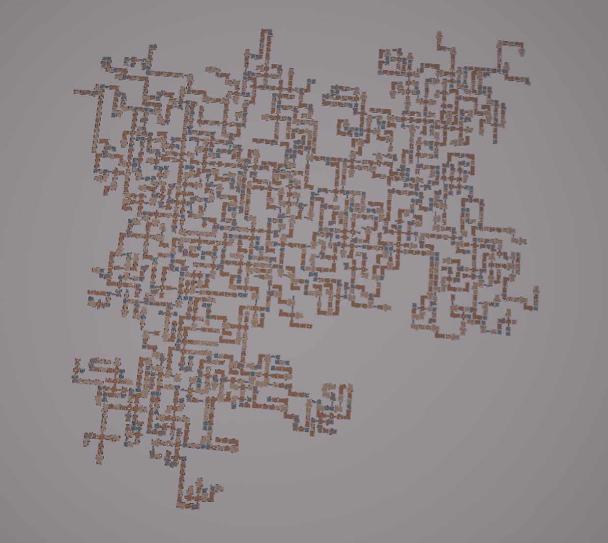
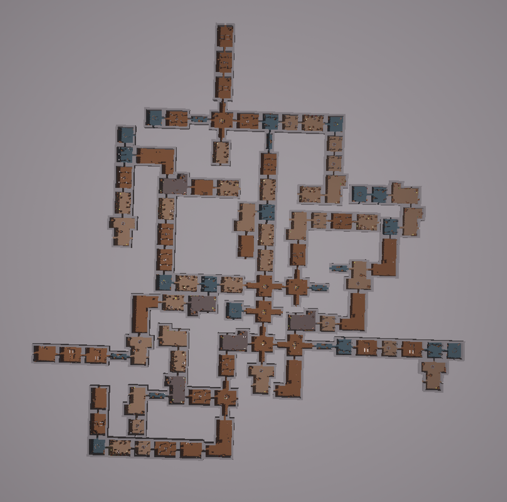
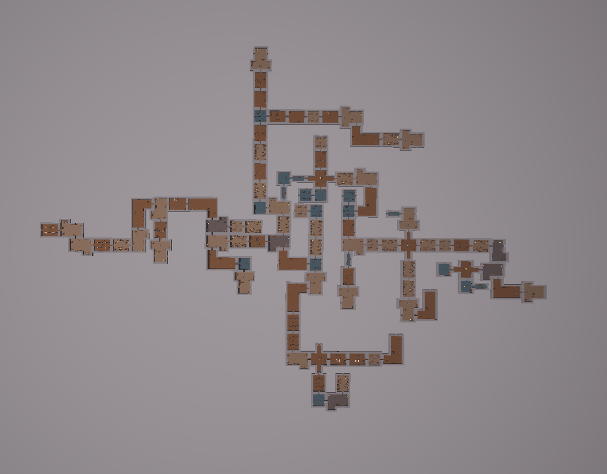

# Procedural Dungeon Generator

Procedural dungeon generation system built with Unreal Engine (C++ & Blueprints)

## Description:

This project implements a procedural dungeon generation algorithm based on controlled randomness.
The dungeon is composed of pre-designed rooms connected through doors, forming a coherent and playable layout.

Each dungeon is generated using a configurable random seed and number of rooms, allowing both reproducibility and variability.
Rooms are placed iteratively, validated for collisions, and connected to ensure a fully traversable structure without isolated areas.

The system is designed as a research and educational project focused on analyzing the impact of randomness on dungeon structure, gameplay viability, and generation performance.

## Gameplay / Generation Preview:

### 2000 rooms

### 100 rooms

### 100 rooms

## What We’re Learning:

1. Designing procedural generation algorithms for dungeon layouts
2. Balancing randomness with structural coherence
3. Implementing collision-aware room placement
4. Using seeded random generators for reproducible results
5. Combining C++ systems with Blueprint-based workflows in Unreal Engine
6. Analyzing performance and scalability of procedural systems

## Team:

* **Jakub Górski** – Project Lead / Programmer
* **Jakub Graczyk** – Programmer
* **Michał Bukowski** – Analysis
* **Mateusz Jarosz** – Tester
* **Natalia Barbosa** – Tester / Design
